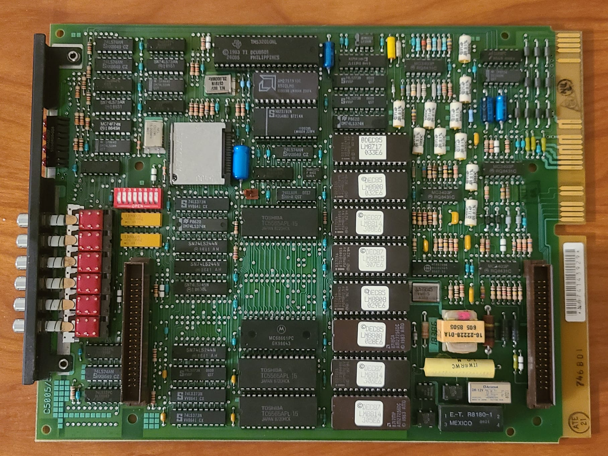
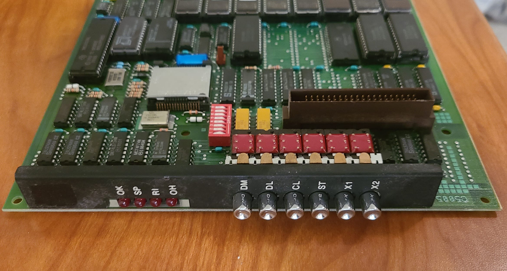
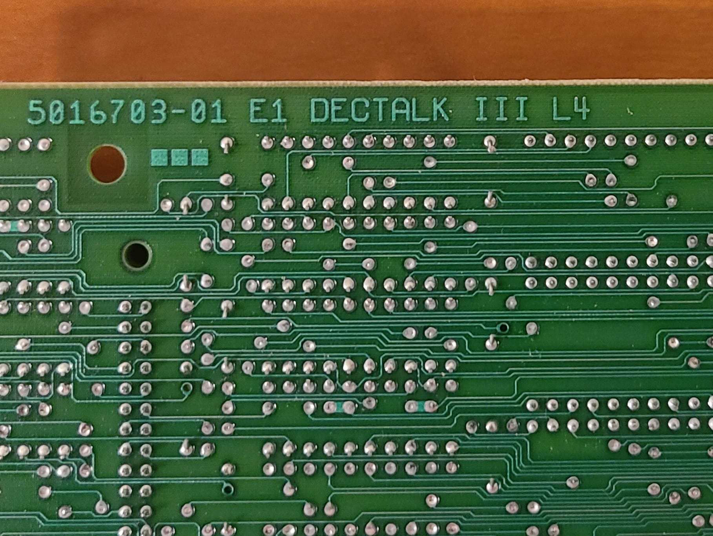

# DECtalk DTC-03 ROMs (1985)

All 27256 EEPROMs containing CPU and program code have been dumped successfully.

All Bipolar ROMs containing DSP code have been dumped successfully. These DSP ROMs are absolutely mandatory for the speech synthesizer to work. Rumor has it that Dennis Klatt himself was the one who coded the DSP program.

Reading in the DSP chips was a special case scenario as I had to do some rewiring to get my T48 programmer to read them. The ROM chips are functionally similar to the 2732 EEPROM chips with the addition of two non-inverted chip enable pins. These chip enable pins were connected to the Vcc pin for this setup at 3 volts.

All checksums match the ones found in the MAME database.

side view:

text on the back:

Both DSP chips being read with custom wiring:

Successful checksum match of one of the DSP ROMs 🤩🤩🤩:

